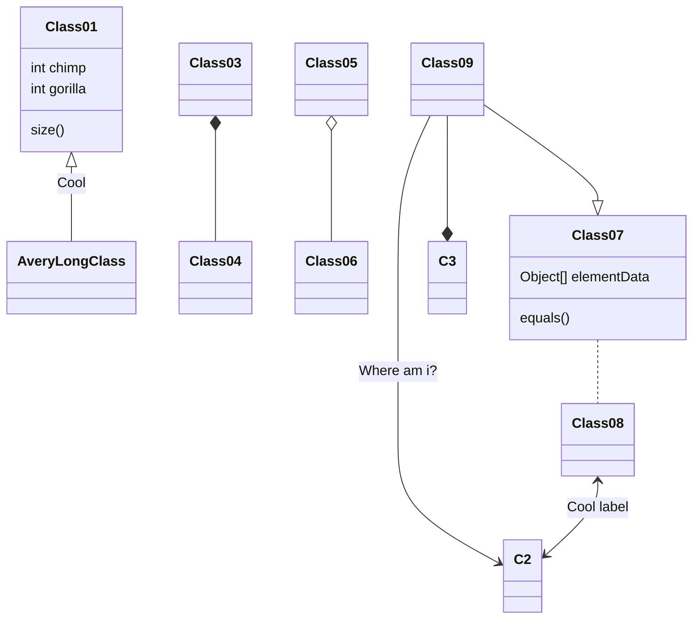
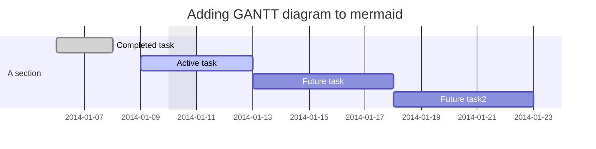

## Mermaid Test
can be viewed with the [GitHub + Mermaid Chrome Extension](https://chrome.google.com/webstore/detail/github-%2B-mermaid/goiiopgdnkogdbjmncgedmgpoajilohe/related?hl=en)

## classDiagram

## Gant Example

## gitGraph

